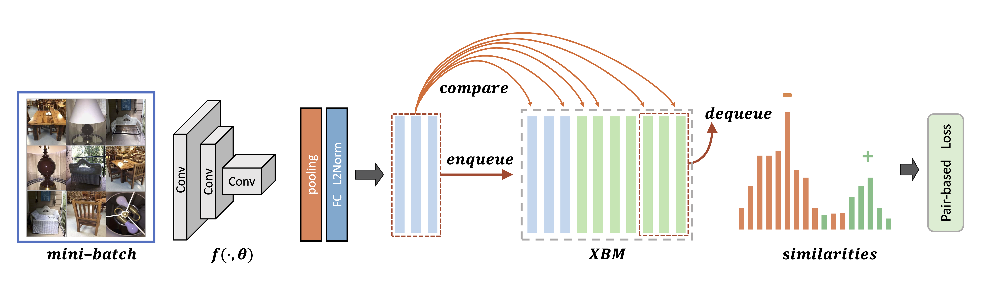

[](https://creativecommons.org/licenses/by-nc/4.0/)

# Cross-Batch Memory for Embedding Learning (XBM)

Code for the CVPR 2020 paper (accepted as Oral) [Cross-Batch Memory for Embedding Learning](https://arxiv.org/pdf/1912.06798)

### XBM: A New SOTA Method for DML


  - Great Improvement: XBM can improve R@1 by 12~25% on three large-scale datasets

  - Memory Efficient: with less than 1GB for large-scale datasets

  - Elegant Algorithm: with an implementation that can be achieved in only several lines

### Installation

```bash
pip install -r requirements.txt
python setup.py develop build
```

### Training and Evaluation

```bash
CUDA_VISIBLE_DEVICES=0 python3 tools/train_net.py --cfg configs/sample_config.yaml 
```

### Contact

For any questions, please feel free to reach 
```
github@malong.com
```

### Citation

        If you use this method or this code in your research, please cite as:

        @inproceedings{wang2020xbm,
        title={Cross-Batch Memory for Embedding Learning},
        author={Wang, Xun and Zhang, Haozhi and Huang, Weilin and Scott, Matthew R},
        booktitle={CVPR},
        year={2020}
        }

        @inproceedings{wang2019multi,
        title={Multi-Similarity Loss with General Pair Weighting for Deep Metric Learning},
        author={Wang, Xun and Han, Xintong and Huang, Weilin and Dong, Dengke and Scott, Matthew R},
        booktitle={CVPR},
        year={2019}
        }

## License

XBM is CC-BY-NC 4.0 licensed, as found in the [LICENSE](LICENSE) file. It is released for academic research / non-commercial use only. If you wish to use for commercial purposes, please contact bd@malong.com.
